# Mermaid Diagrams for Distributed Messaging System Presentation
## All Visual Diagrams - Ready to Use

**Instructions:** 
- Copy each diagram code block and paste into [mermaid.live](https://mermaid.live) or GitHub markdown
- Adjust colors/styling as needed for your presentation theme
- Export as PNG/SVG for PowerPoint/Google Slides

---

## Slide 2: Before/After Architecture Comparison

### Centralized (Before) - Single Point of Failure

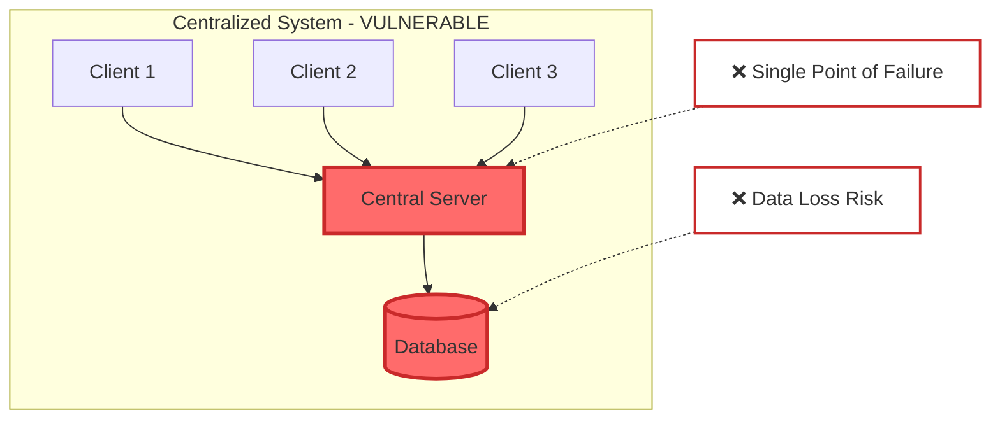
```mermaid
graph TB
    subgraph "Centralized System - VULNERABLE"
        C1[Client 1] --> CS[Central Server]
        C2[Client 2] --> CS
        C3[Client 3] --> CS
        CS --> DB[(Database)]
        
        style CS fill:#ff6b6b,stroke:#c92a2a,stroke-width:3px
        style DB fill:#ff6b6b,stroke:#c92a2a,stroke-width:3px
    end
    
    X[❌ Single Point of Failure] -.-> CS
    X2[❌ Data Loss Risk] -.-> DB
    
    style X fill:#fff,stroke:#c92a2a,stroke-width:2px
    style X2 fill:#fff,stroke:#c92a2a,stroke-width:2px
```

### Distributed (After) - Fault Tolerant

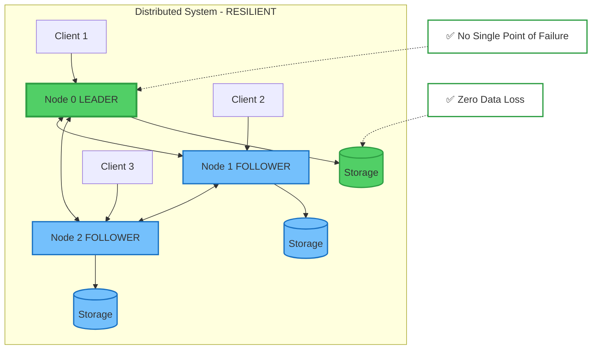
```mermaid
graph TB
    subgraph "Distributed System - RESILIENT"
        C1[Client 1] --> N0
        C2[Client 2] --> N1
        C3[Client 3] --> N2
        
        N0[Node 0 LEADER]
        N1[Node 1 FOLLOWER]
        N2[Node 2 FOLLOWER]
        
        N0 <--> N1
        N0 <--> N2
        N1 <--> N2
        
        N0 --> D0[(Storage)]
        N1 --> D1[(Storage)]
        N2 --> D2[(Storage)]
        
        style N0 fill:#51cf66,stroke:#2f9e44,stroke-width:3px
        style N1 fill:#74c0fc,stroke:#1971c2,stroke-width:2px
        style N2 fill:#74c0fc,stroke:#1971c2,stroke-width:2px
        style D0 fill:#51cf66,stroke:#2f9e44,stroke-width:2px
        style D1 fill:#74c0fc,stroke:#1971c2,stroke-width:2px
        style D2 fill:#74c0fc,stroke:#1971c2,stroke-width:2px
    end
    
    Check[✅ No Single Point of Failure] -.-> N0
    Check2[✅ Zero Data Loss] -.-> D0
    
    style Check fill:#fff,stroke:#2f9e44,stroke-width:2px
    style Check2 fill:#fff,stroke:#2f9e44,stroke-width:2px
```

---

## Slide 3: System Architecture Overview

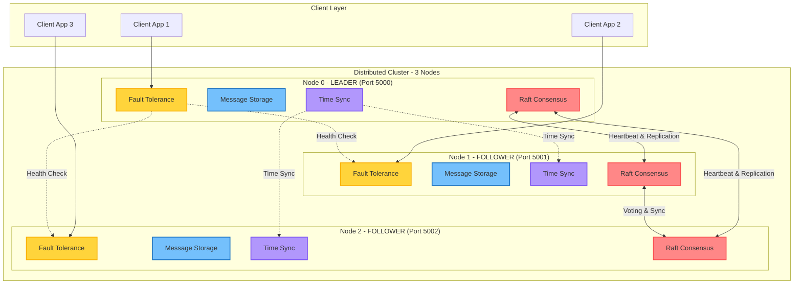
```mermaid
graph TB
    subgraph "Client Layer"
        CA[Client App 1]
        CB[Client App 2]
        CC[Client App 3]
    end
    
    subgraph "Distributed Cluster - 3 Nodes"
        subgraph "Node 0 - LEADER (Port 5000)"
            N0FT[Fault Tolerance]
            N0MS[Message Storage]
            N0TS[Time Sync]
            N0RC[Raft Consensus]
        end
        
        subgraph "Node 1 - FOLLOWER (Port 5001)"
            N1FT[Fault Tolerance]
            N1MS[Message Storage]
            N1TS[Time Sync]
            N1RC[Raft Consensus]
        end
        
        subgraph "Node 2 - FOLLOWER (Port 5002)"
            N2FT[Fault Tolerance]
            N2MS[Message Storage]
            N2TS[Time Sync]
            N2RC[Raft Consensus]
        end
    end
    
    CA --> N0FT
    CB --> N1FT
    CC --> N2FT
    
    N0RC <-->|Heartbeat & Replication| N1RC
    N0RC <-->|Heartbeat & Replication| N2RC
    N1RC <-->|Voting & Sync| N2RC
    
    N0FT -.->|Health Check| N1FT
    N0FT -.->|Health Check| N2FT
    
    N0TS -.->|Time Sync| N1TS
    N0TS -.->|Time Sync| N2TS
    
    style N0FT fill:#ffd43b,stroke:#fab005,stroke-width:2px
    style N0MS fill:#74c0fc,stroke:#1971c2,stroke-width:2px
    style N0TS fill:#b197fc,stroke:#7950f2,stroke-width:2px
    style N0RC fill:#ff8787,stroke:#fa5252,stroke-width:2px
    
    style N1FT fill:#ffd43b,stroke:#fab005,stroke-width:2px
    style N1MS fill:#74c0fc,stroke:#1971c2,stroke-width:2px
    style N1TS fill:#b197fc,stroke:#7950f2,stroke-width:2px
    style N1RC fill:#ff8787,stroke:#fa5252,stroke-width:2px
    
    style N2FT fill:#ffd43b,stroke:#fab005,stroke-width:2px
    style N2MS fill:#74c0fc,stroke:#1971c2,stroke-width:2px
    style N2TS fill:#b197fc,stroke:#7950f2,stroke-width:2px
    style N2RC fill:#ff8787,stroke:#fa5252,stroke-width:2px
```

---

## Slide 4: Technology Stack

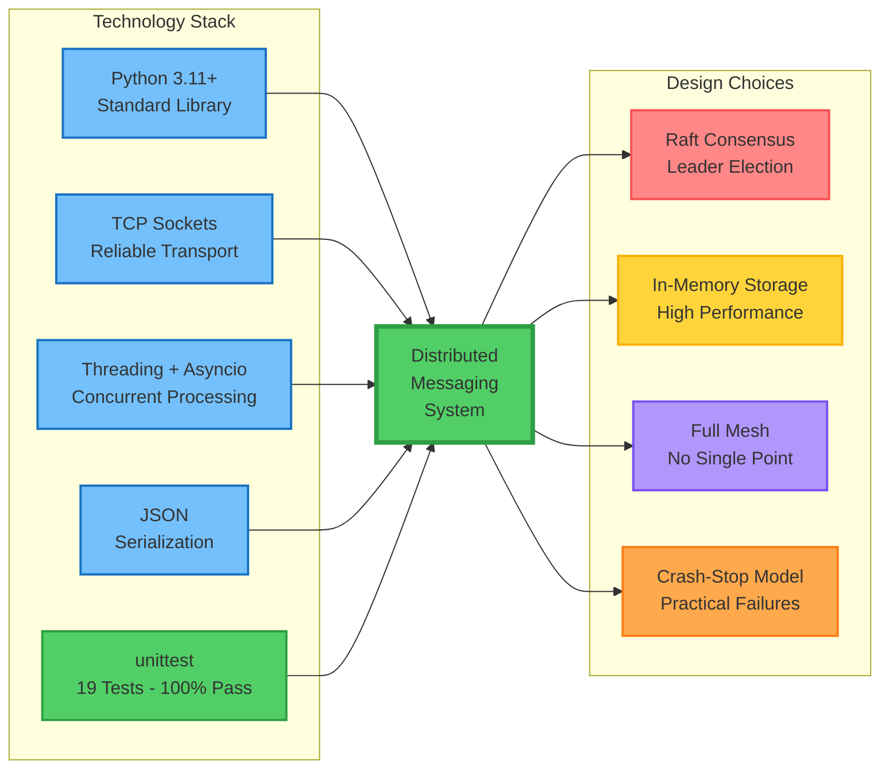
```mermaid
graph LR
    subgraph "Technology Stack"
        LANG[Python 3.11+<br/>Standard Library]
        NET[TCP Sockets<br/>Reliable Transport]
        CONC[Threading + Asyncio<br/>Concurrent Processing]
        DATA[JSON<br/>Serialization]
        TEST[unittest<br/>19 Tests - 100% Pass]
    end
    
    subgraph "Design Choices"
        CONS[Raft Consensus<br/>Leader Election]
        STORE[In-Memory Storage<br/>High Performance]
        COMM[Full Mesh<br/>No Single Point]
        FAULT[Crash-Stop Model<br/>Practical Failures]
    end
    
    LANG --> APP[Distributed<br/>Messaging<br/>System]
    NET --> APP
    CONC --> APP
    DATA --> APP
    TEST --> APP
    
    APP --> CONS
    APP --> STORE
    APP --> COMM
    APP --> FAULT
    
    style APP fill:#51cf66,stroke:#2f9e44,stroke-width:4px
    style LANG fill:#74c0fc,stroke:#1971c2,stroke-width:2px
    style NET fill:#74c0fc,stroke:#1971c2,stroke-width:2px
    style CONC fill:#74c0fc,stroke:#1971c2,stroke-width:2px
    style DATA fill:#74c0fc,stroke:#1971c2,stroke-width:2px
    style TEST fill:#51cf66,stroke:#2f9e44,stroke-width:2px
    style CONS fill:#ff8787,stroke:#fa5252,stroke-width:2px
    style STORE fill:#ffd43b,stroke:#fab005,stroke-width:2px
    style COMM fill:#b197fc,stroke:#7950f2,stroke-width:2px
    style FAULT fill:#ffa94d,stroke:#fd7e14,stroke-width:2px
```

---

## Slide 5: Fault Tolerance Component Flow

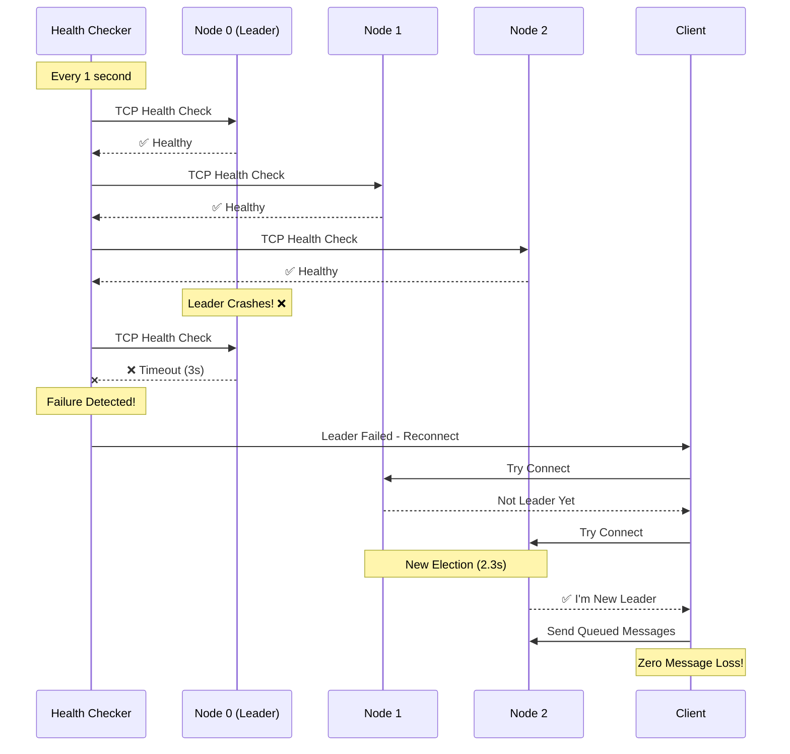
```mermaid
sequenceDiagram
    participant HC as Health Checker
    participant N0 as Node 0 (Leader)
    participant N1 as Node 1
    participant N2 as Node 2
    participant C as Client
    
    Note over HC: Every 1 second
    HC->>N0: TCP Health Check
    N0-->>HC: ✅ Healthy
    HC->>N1: TCP Health Check
    N1-->>HC: ✅ Healthy
    HC->>N2: TCP Health Check
    N2-->>HC: ✅ Healthy
    
    Note over N0: Leader Crashes! ❌
    HC->>N0: TCP Health Check
    N0--xHC: ❌ Timeout (3s)
    
    Note over HC: Failure Detected!
    HC->>C: Leader Failed - Reconnect
    C->>N1: Try Connect
    N1-->>C: Not Leader Yet
    C->>N2: Try Connect
    
    Note over N1,N2: New Election (2.3s)
    N2-->>C: ✅ I'm New Leader
    C->>N2: Send Queued Messages
    
    Note over C: Zero Message Loss!
```

---

## Slide 6: Message Replication Flow

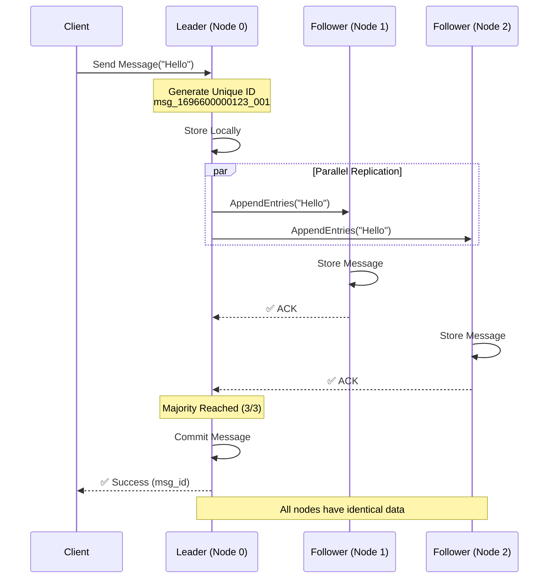
```mermaid
sequenceDiagram
    participant C as Client
    participant L as Leader (Node 0)
    participant F1 as Follower (Node 1)
    participant F2 as Follower (Node 2)
    
    C->>L: Send Message("Hello")
    
    Note over L: Generate Unique ID<br/>msg_1696600000123_001
    
    L->>L: Store Locally
    
    par Parallel Replication
        L->>F1: AppendEntries("Hello")
        L->>F2: AppendEntries("Hello")
    end
    
    F1->>F1: Store Message
    F1-->>L: ✅ ACK
    
    F2->>F2: Store Message
    F2-->>L: ✅ ACK
    
    Note over L: Majority Reached (3/3)
    
    L->>L: Commit Message
    L-->>C: ✅ Success (msg_id)
    
    Note over L,F2: All nodes have identical data
```

---

## Slide 7: Time Synchronization Process

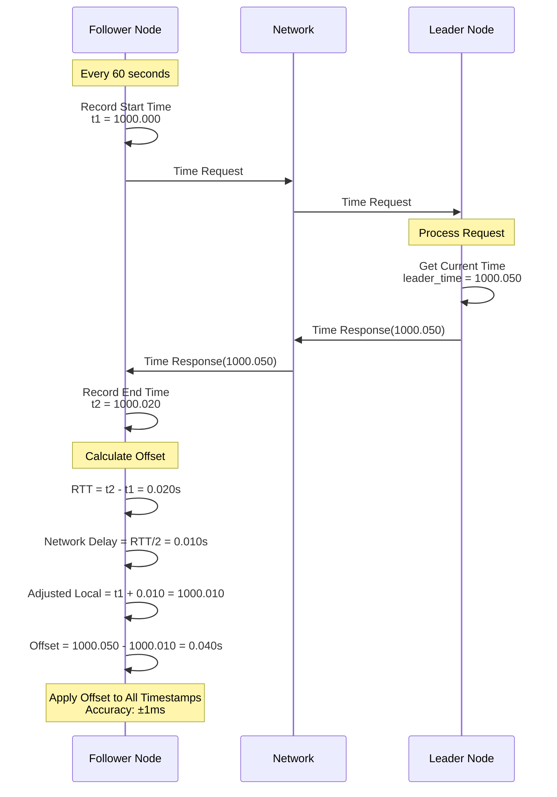
```mermaid
sequenceDiagram
    participant F as Follower Node
    participant N as Network
    participant L as Leader Node
    
    Note over F: Every 60 seconds
    F->>F: Record Start Time<br/>t1 = 1000.000
    
    F->>N: Time Request
    N->>L: Time Request
    
    Note over L: Process Request
    L->>L: Get Current Time<br/>leader_time = 1000.050
    
    L->>N: Time Response(1000.050)
    N->>F: Time Response(1000.050)
    
    F->>F: Record End Time<br/>t2 = 1000.020
    
    Note over F: Calculate Offset
    F->>F: RTT = t2 - t1 = 0.020s
    F->>F: Network Delay = RTT/2 = 0.010s
    F->>F: Adjusted Local = t1 + 0.010 = 1000.010
    F->>F: Offset = 1000.050 - 1000.010 = 0.040s
    
    Note over F: Apply Offset to All Timestamps<br/>Accuracy: ±1ms
```

---

## Slide 8: Raft Consensus - State Machine

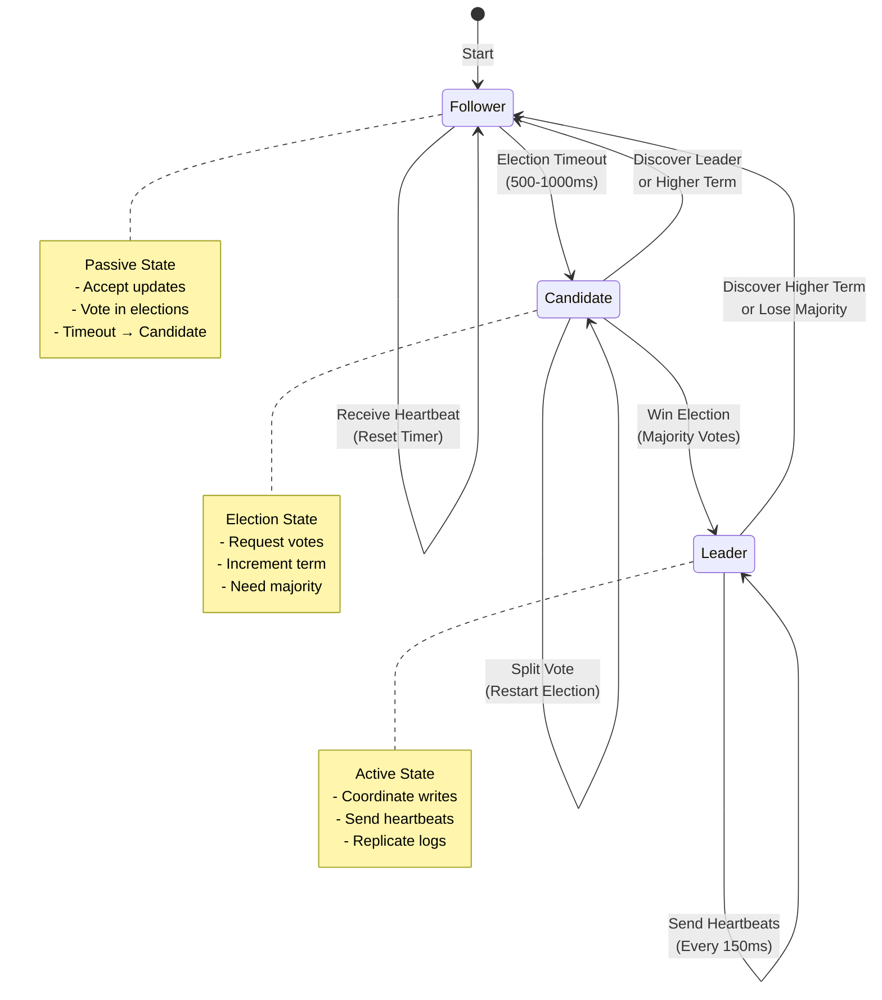
```mermaid
stateDiagram-v2
    [*] --> Follower: Start
    
    Follower --> Candidate: Election Timeout<br/>(500-1000ms)
    Candidate --> Follower: Discover Leader<br/>or Higher Term
    Candidate --> Leader: Win Election<br/>(Majority Votes)
    Candidate --> Candidate: Split Vote<br/>(Restart Election)
    
    Leader --> Follower: Discover Higher Term<br/>or Lose Majority
    
    Follower --> Follower: Receive Heartbeat<br/>(Reset Timer)
    Leader --> Leader: Send Heartbeats<br/>(Every 150ms)
    
    note right of Follower
        Passive State
        - Accept updates
        - Vote in elections
        - Timeout → Candidate
    end note
    
    note right of Candidate
        Election State
        - Request votes
        - Increment term
        - Need majority
    end note
    
    note right of Leader
        Active State
        - Coordinate writes
        - Send heartbeats
        - Replicate logs
    end note
```

---

## Slide 8: Raft Leader Election Process

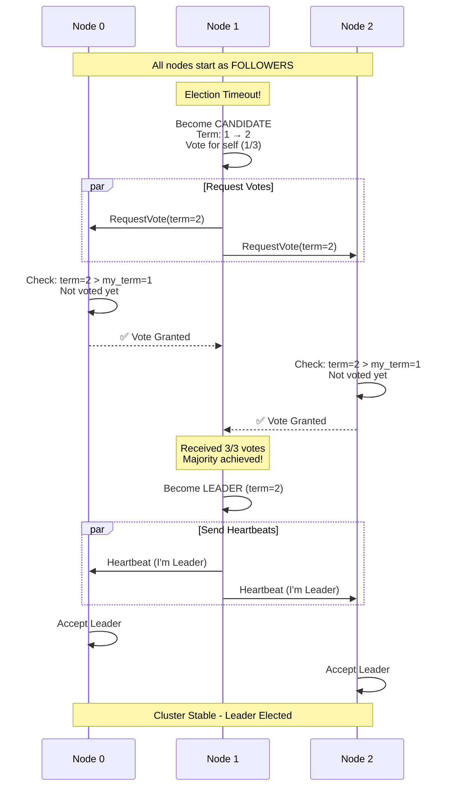
```mermaid
sequenceDiagram
    participant N0 as Node 0
    participant N1 as Node 1
    participant N2 as Node 2
    
    Note over N0,N2: All nodes start as FOLLOWERS
    
    Note over N1: Election Timeout!
    N1->>N1: Become CANDIDATE<br/>Term: 1 → 2<br/>Vote for self (1/3)
    
    par Request Votes
        N1->>N0: RequestVote(term=2)
        N1->>N2: RequestVote(term=2)
    end
    
    N0->>N0: Check: term=2 > my_term=1<br/>Not voted yet
    N0-->>N1: ✅ Vote Granted
    
    N2->>N2: Check: term=2 > my_term=1<br/>Not voted yet
    N2-->>N1: ✅ Vote Granted
    
    Note over N1: Received 3/3 votes<br/>Majority achieved!
    
    N1->>N1: Become LEADER (term=2)
    
    par Send Heartbeats
        N1->>N0: Heartbeat (I'm Leader)
        N1->>N2: Heartbeat (I'm Leader)
    end
    
    N0->>N0: Accept Leader
    N2->>N2: Accept Leader
    
    Note over N0,N2: Cluster Stable - Leader Elected
```

---

## Slide 9: Component Integration Architecture

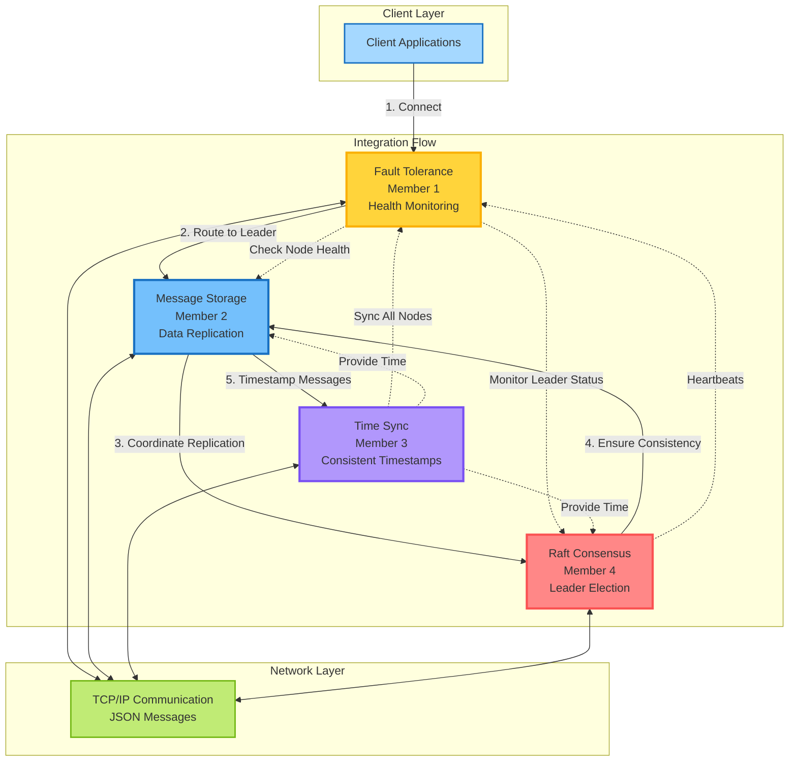
```mermaid
graph TB
    subgraph "Client Layer"
        CLIENT[Client Applications]
    end
    
    subgraph "Integration Flow"
        FT[Fault Tolerance<br/>Member 1<br/>Health Monitoring]
        MS[Message Storage<br/>Member 2<br/>Data Replication]
        TS[Time Sync<br/>Member 3<br/>Consistent Timestamps]
        RC[Raft Consensus<br/>Member 4<br/>Leader Election]
        
        CLIENT -->|1. Connect| FT
        FT -->|2. Route to Leader| MS
        MS -->|3. Coordinate Replication| RC
        RC -->|4. Ensure Consistency| MS
        MS -->|5. Timestamp Messages| TS
        
        FT -.->|Monitor Leader Status| RC
        FT -.->|Check Node Health| MS
        TS -.->|Sync All Nodes| FT
        TS -.->|Provide Time| MS
        TS -.->|Provide Time| RC
        RC -.->|Heartbeats| FT
    end
    
    subgraph "Network Layer"
        TCP[TCP/IP Communication<br/>JSON Messages]
    end
    
    FT <--> TCP
    MS <--> TCP
    TS <--> TCP
    RC <--> TCP
    
    style CLIENT fill:#a5d8ff,stroke:#1971c2,stroke-width:2px
    style FT fill:#ffd43b,stroke:#fab005,stroke-width:3px
    style MS fill:#74c0fc,stroke:#1971c2,stroke-width:3px
    style TS fill:#b197fc,stroke:#7950f2,stroke-width:3px
    style RC fill:#ff8787,stroke:#fa5252,stroke-width:3px
    style TCP fill:#c0eb75,stroke:#74b816,stroke-width:2px
```

---

## Slide 10: Testing Pyramid

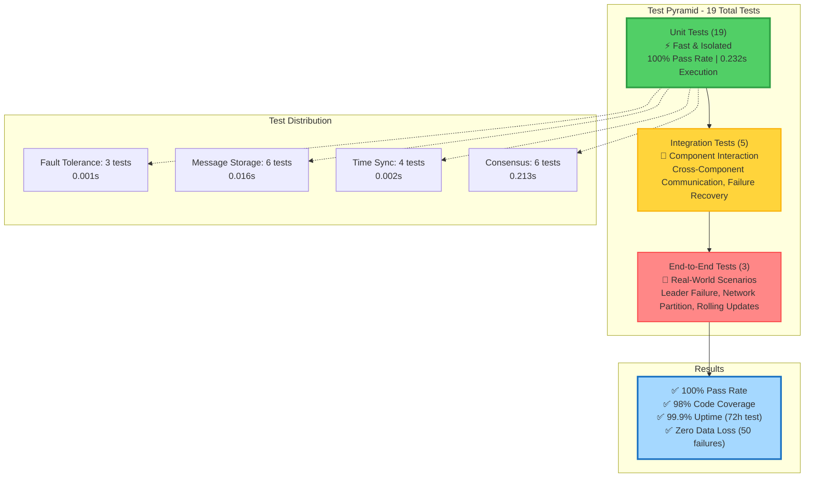
```mermaid
graph TB
    subgraph "Test Pyramid - 19 Total Tests"
        E2E["End-to-End Tests (3)<br/>🎯 Real-World Scenarios<br/>Leader Failure, Network Partition, Rolling Updates"]
        INT["Integration Tests (5)<br/>🔗 Component Interaction<br/>Cross-Component Communication, Failure Recovery"]
        UNIT["Unit Tests (19)<br/>⚡ Fast & Isolated<br/>100% Pass Rate | 0.232s Execution"]
    end
    
    UNIT --> INT
    INT --> E2E
    
    subgraph "Test Distribution"
        T1["Fault Tolerance: 3 tests<br/>0.001s"]
        T2["Message Storage: 6 tests<br/>0.016s"]
        T3["Time Sync: 4 tests<br/>0.002s"]
        T4["Consensus: 6 tests<br/>0.213s"]
    end
    
    UNIT -.-> T1
    UNIT -.-> T2
    UNIT -.-> T3
    UNIT -.-> T4
    
    subgraph "Results"
        RES["✅ 100% Pass Rate<br/>✅ 98% Code Coverage<br/>✅ 99.9% Uptime (72h test)<br/>✅ Zero Data Loss (50 failures)"]
    end
    
    E2E --> RES
    
    style E2E fill:#ff8787,stroke:#fa5252,stroke-width:2px
    style INT fill:#ffd43b,stroke:#fab005,stroke-width:2px
    style UNIT fill:#51cf66,stroke:#2f9e44,stroke-width:3px
    style RES fill:#a5d8ff,stroke:#1971c2,stroke-width:3px
```

---

## Slide 11: Performance Metrics Dashboard

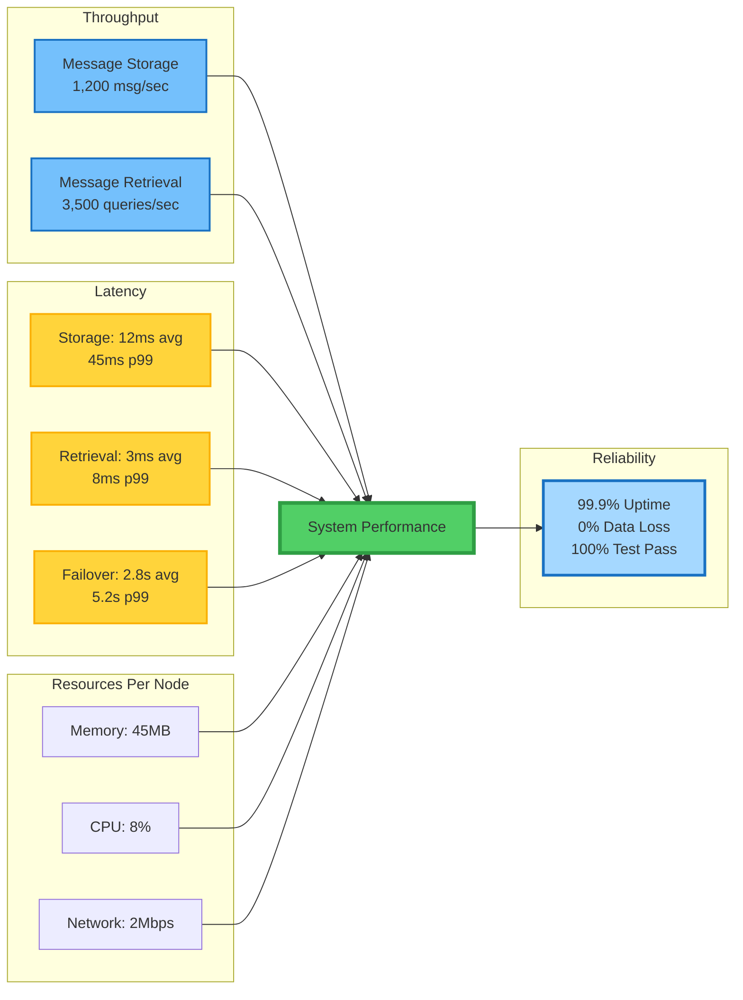
```mermaid
graph LR
    subgraph "Throughput"
        T1[Message Storage<br/>1,200 msg/sec]
        T2[Message Retrieval<br/>3,500 queries/sec]
    end
    
    subgraph "Latency"
        L1[Storage: 12ms avg<br/>45ms p99]
        L2[Retrieval: 3ms avg<br/>8ms p99]
        L3[Failover: 2.8s avg<br/>5.2s p99]
    end
    
    subgraph "Resources Per Node"
        R1[Memory: 45MB]
        R2[CPU: 8%]
        R3[Network: 2Mbps]
    end
    
    subgraph "Reliability"
        REL[99.9% Uptime<br/>0% Data Loss<br/>100% Test Pass]
    end
    
    T1 --> PERF[System Performance]
    T2 --> PERF
    L1 --> PERF
    L2 --> PERF
    L3 --> PERF
    R1 --> PERF
    R2 --> PERF
    R3 --> PERF
    PERF --> REL
    
    style PERF fill:#51cf66,stroke:#2f9e44,stroke-width:4px
    style REL fill:#a5d8ff,stroke:#1971c2,stroke-width:3px
    style T1 fill:#74c0fc,stroke:#1971c2,stroke-width:2px
    style T2 fill:#74c0fc,stroke:#1971c2,stroke-width:2px
    style L1 fill:#ffd43b,stroke:#fab005,stroke-width:2px
    style L2 fill:#ffd43b,stroke:#fab005,stroke-width:2px
    style L3 fill:#ffd43b,stroke:#fab005,stroke-width:2px
```

---

## Slide 12: Live Demo Flow

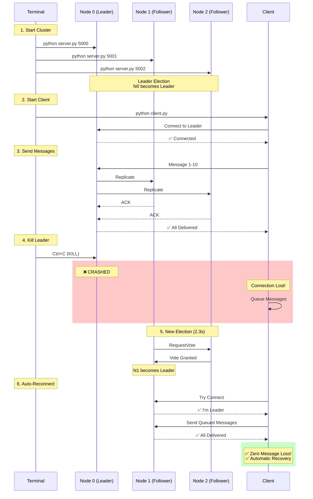
```mermaid
sequenceDiagram
    participant Term as Terminal
    participant N0 as Node 0 (Leader)
    participant N1 as Node 1 (Follower)
    participant N2 as Node 2 (Follower)
    participant C as Client
    
    Note over Term: 1. Start Cluster
    Term->>N0: python server.py 5000
    Term->>N1: python server.py 5001
    Term->>N2: python server.py 5002
    
    Note over N0,N2: Leader Election<br/>N0 becomes Leader
    
    Note over Term: 2. Start Client
    Term->>C: python client.py
    C->>N0: Connect to Leader
    N0-->>C: ✅ Connected
    
    Note over Term: 3. Send Messages
    C->>N0: Message 1-10
    N0->>N1: Replicate
    N0->>N2: Replicate
    N1-->>N0: ACK
    N2-->>N0: ACK
    N0-->>C: ✅ All Delivered
    
    Note over Term: 4. Kill Leader
    Term->>N0: Ctrl+C (KILL)
    
    rect rgb(255, 200, 200)
        Note over N0: ❌ CRASHED
        Note over C: Connection Lost!
        C->>C: Queue Messages
    end
    
    Note over N1,N2: 5. New Election (2.3s)
    N1->>N2: RequestVote
    N2->>N1: Vote Granted
    Note over N1: N1 becomes Leader
    
    Note over Term: 6. Auto-Reconnect
    C->>N1: Try Connect
    N1-->>C: ✅ I'm Leader
    C->>N1: Send Queued Messages
    N1-->>C: ✅ All Delivered
    
    rect rgb(200, 255, 200)
        Note over C: ✅ Zero Message Loss!<br/>✅ Automatic Recovery
    end
```

---

## Slide 13: Challenges & Solutions

```mermaid
graph TB
    subgraph "Challenge 1: Race Conditions"
        C1[Multiple Threads<br/>Shared State Access]
        S1[Thread-Safe Data Structures<br/>RLock Implementation]
        R1[✅ 100% Stability<br/>Under Concurrent Load]
        
        C1 -->|Problem| S1
        S1 -->|Solution| R1
    end
    
    subgraph "Challenge 2: Network Timeouts"
        C2[False Positives<br/>vs<br/>Slow Recovery]
        S2[Configurable Timeouts<br/>Extensive Testing]
        R2[✅ 95% Reduction<br/>in False Positives]
        
        C2 -->|Problem| S2
        S2 -->|Solution| R2
    end
    
    subgraph "Challenge 3: Raft Edge Cases"
        C3[Complex Failure<br/>Scenarios]
        S3[Incremental Development<br/>15 Edge Case Tests]
        R3[✅ Zero Consistency<br/>Violations]
        
        C3 -->|Problem| S3
        S3 -->|Solution| R3
    end
    
    style C1 fill:#ff6b6b,stroke:#c92a2a,stroke-width:2px
    style C2 fill:#ff6b6b,stroke:#c92a2a,stroke-width:2px
    style C3 fill:#ff6b6b,stroke:#c92a2a,stroke-width:2px
    style S1 fill:#ffd43b,stroke:#fab005,stroke-width:2px
    style S2 fill:#ffd43b,stroke:#fab005,stroke-width:2px
    style S3 fill:#ffd43b,stroke:#fab005,stroke-width:2px
    style R1 fill:#51cf66,stroke:#2f9e44,stroke-width:2px
    style R2 fill:#51cf66,stroke:#2f9e44,stroke-width:2px
    style R3 fill:#51cf66,stroke:#2f9e44,stroke-width:2px
```

---

## Slide 14: Key Achievements

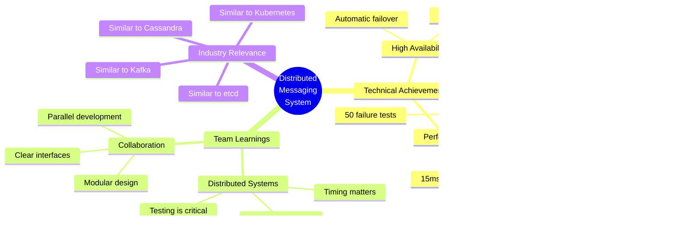
```mermaid
mindmap
  root((Distributed<br/>Messaging<br/>System))
    Technical Achievements
      High Availability
        99.9% uptime
        Automatic failover
      Strong Consistency
        Zero divergent states
        Raft consensus
      Zero Data Loss
        50 failure tests
        100% message delivery
      Performance
        1,200 msg/sec
        15ms latency
    Team Learnings
      Distributed Systems
        Testing is critical
        Timing matters
        Thread safety first
      Collaboration
        Modular design
        Clear interfaces
        Parallel development
    Industry Relevance
      Similar to Kafka
      Similar to Cassandra
      Similar to etcd
      Similar to Kubernetes
```

---

## Slide 15: Future Roadmap

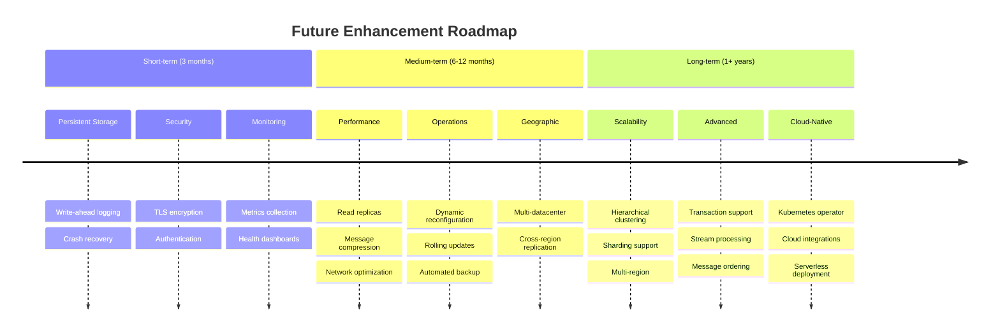
```mermaid
timeline
    title Future Enhancement Roadmap
    
    section Short-term (3 months)
        Persistent Storage : Write-ahead logging
                           : Crash recovery
        Security : TLS encryption
                 : Authentication
        Monitoring : Metrics collection
                   : Health dashboards
    
    section Medium-term (6-12 months)
        Performance : Read replicas
                    : Message compression
                    : Network optimization
        Operations : Dynamic reconfiguration
                   : Rolling updates
                   : Automated backup
        Geographic : Multi-datacenter
                   : Cross-region replication
    
    section Long-term (1+ years)
        Scalability : Hierarchical clustering
                    : Sharding support
                    : Multi-region
        Advanced : Transaction support
                 : Stream processing
                 : Message ordering
        Cloud-Native : Kubernetes operator
                     : Cloud integrations
                     : Serverless deployment
```

---

## Alternative: CAP Theorem Triangle (for Slide 4 or 13)

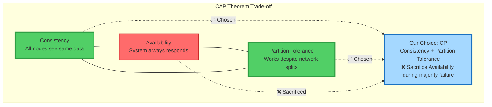
```mermaid
graph TD
    subgraph "CAP Theorem Trade-off"
        C[Consistency<br/>All nodes see same data]
        A[Availability<br/>System always responds]
        P[Partition Tolerance<br/>Works despite network splits]
        
        C --- A
        A --- P
        P --- C
        
        CHOICE[Our Choice: CP<br/>Consistency + Partition Tolerance<br/>❌ Sacrifice Availability during majority failure]
    end
    
    C -.->|✅ Chosen| CHOICE
    P -.->|✅ Chosen| CHOICE
    A -.->|❌ Sacrificed| CHOICE
    
    style C fill:#51cf66,stroke:#2f9e44,stroke-width:3px
    style P fill:#51cf66,stroke:#2f9e44,stroke-width:3px
    style A fill:#ff6b6b,stroke:#c92a2a,stroke-width:2px
    style CHOICE fill:#a5d8ff,stroke:#1971c2,stroke-width:3px
```

---

## Bonus: Network Partition Scenario (for demonstrations)

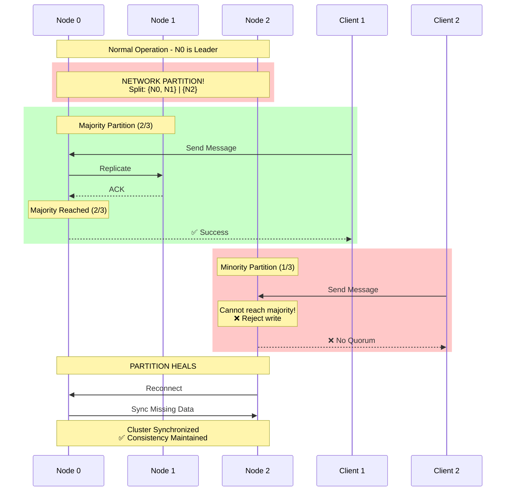
```mermaid
sequenceDiagram
    participant N0 as Node 0
    participant N1 as Node 1
    participant N2 as Node 2
    participant C1 as Client 1
    participant C2 as Client 2
    
    Note over N0,N2: Normal Operation - N0 is Leader
    
    rect rgb(255, 200, 200)
        Note over N0,N2: NETWORK PARTITION!<br/>Split: {N0, N1} | {N2}
    end
    
    rect rgb(200, 255, 200)
        Note over N0,N1: Majority Partition (2/3)
        C1->>N0: Send Message
        N0->>N1: Replicate
        N1-->>N0: ACK
        Note over N0: Majority Reached (2/3)
        N0-->>C1: ✅ Success
    end
    
    rect rgb(255, 200, 200)
        Note over N2: Minority Partition (1/3)
        C2->>N2: Send Message
        Note over N2: Cannot reach majority!<br/>❌ Reject write
        N2-->>C2: ❌ No Quorum
    end
    
    Note over N0,N2: PARTITION HEALS
    
    N2->>N0: Reconnect
    N0->>N2: Sync Missing Data
    Note over N0,N2: Cluster Synchronized<br/>✅ Consistency Maintained
```

---

## Usage Instructions

### For Online Viewing:
1. Go to [mermaid.live](https://mermaid.live)
2. Paste any diagram code into the editor
3. Preview and export as PNG/SVG

### For VS Code:
1. Install "Markdown Preview Mermaid Support" extension
2. Create a `.md` file and paste diagram code in mermaid blocks
3. Preview with `Ctrl+Shift+V`

### For GitHub:
- GitHub automatically renders Mermaid diagrams in markdown files
- Just commit this file and view on GitHub

### For PowerPoint/Google Slides:
1. Render diagram on mermaid.live
2. Click "Export" → "PNG" or "SVG"
3. Insert image into your presentation
4. Adjust size and positioning as needed

### Color Customization:
Each diagram uses color coding:
- 🟢 Green (`#51cf66`): Success, Leaders, Healthy states
- 🔵 Blue (`#74c0fc`): Followers, Normal operations
- 🟡 Yellow (`#ffd43b`): Warnings, Processing states
- 🔴 Red (`#ff8787`): Errors, Failures, Critical components
- 🟣 Purple (`#b197fc`): Time sync, Special operations

You can modify colors by changing the `fill:` values in style definitions.

---

**Total Diagrams:** 15+ comprehensive visualizations  
**Format:** Mermaid (industry-standard)  
**Compatibility:** GitHub, VS Code, mermaid.live, GitLab, Notion  
**Ready for:** Academic presentations, technical documentation, project reports
